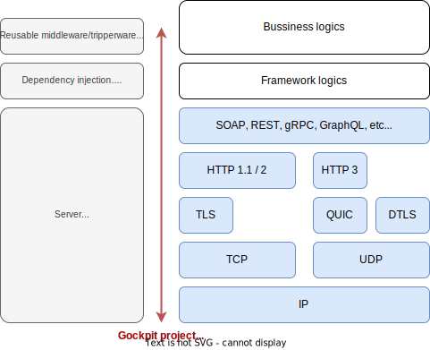
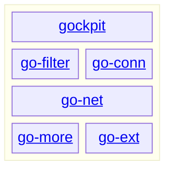

# Gockpit Project

Gockpit is the fully featured framework for [Go](https://go.dev/).

## Project scope

Gockpit is aimed to be used everywhere in monolithic and microservice applications.
It consists of 3 layered parts listed below.
Gockpit also contains some standalone packages that can be used for any kind of projects.

1. **Networking**
1. **Application Framework**
1. **Reusable Features**

[Spring Framework](https://spring.io/projects/spring-framework) is one of the most successful projects in Java community.
We are gonna be Spring like project in Go community.

## Repository structure

Gockpit consists of the following major repositories.
Repositories located on the lower positions provides lower level and more atomic features.

- [gockpit](https://github.com/gockpit/gockpit) provides Web application frameworks.
- [go-filter](https://github.com/gockpit/go-filter) provides middleware and tripperware.
- [go-conn](https://github.com/gockpit/go-conn) provides external storage connections.
- [go-net](https://github.com/gockpit/go-net) provides networking features.
- [go-more](https://github.com/gockpit/go-more) provides more extension features than go-ext.
- [go-ext](https://github.com/gockpit/go-ext) provides extension features for go standard packages.

## Goals and Non Goals

**Goals.**

- Provide fully featured networking
  - Easy to use
  - Highly customizable
  - Highly extensible
- Provide application frameworks
  - Selectable by users
  
**Non Goals.**

- Provide use case specific logics.

## Well known existing frameworks

We respect all leading web frameworks.
We lean many things from them.

- [gin-gonic/gin](https://github.com/gin-gonic/gin)
- [labstack/echo](https://github.com/labstack/echo)
- [gofiber/fiber](https://github.com/gofiber/fiber)
- [beego/beego](https://github.com/beego/beego)
- [zeromicro/go-zero](https://github.com/zeromicro/go-zero)
